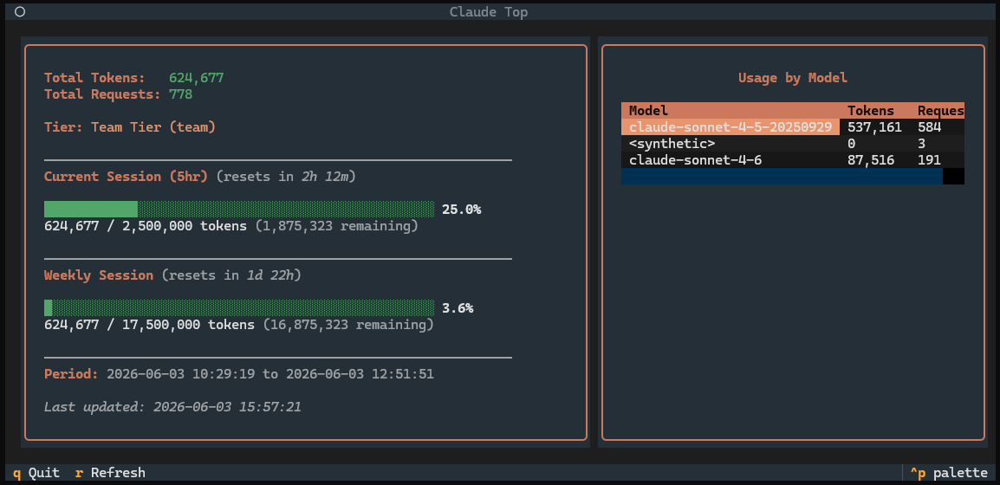

# claude-top



A CLI + TUI utility for inspecting Claude Code usage from local session files.

`claude-top` reads your local Claude history (`~/.claude/projects/**/*.jsonl`), aggregates token/request metrics, and presents them in either:

- an interactive Textual dashboard (default),
- a Rich terminal table (`--no-ui`), or
- JSON (`--json`).

## What it shows

- Total input/output tokens and request count
- Per-model usage breakdown
- Optional detailed stats (`--detailed`):
   - cache reads/writes and hit rate
   - average tokens per request
   - estimated cost (informational)
   - 7-day trend sparkline
   - week-over-week comparison
   - top projects by token usage
- Tier-aware usage bars and warnings (80%/90%) when tier metadata is available

## Requirements

- Python 3.9+
- Existing Claude Code data in `~/.claude/projects`

Notes:
- No setup is required to read local usage files.
- If `~/.claude/.credentials.json` is present with a valid OAuth token, `claude-top` fetches utilization percentages from the Anthropic OAuth usage API on a configurable interval (default: once per minute). Local session files are read more frequently to track new tokens without hitting rate limits.

## Installation

### Run without install (uvx)

```bash
uvx claude-top
```

### Install globally (uv)

```bash
uv tool install claude-top
```

### Install with pip

```bash
pip install claude-top
```

### From source

```bash
git clone https://github.com/xpodev/claude-top.git
cd claude-top
uv pip install -e .
```

## Usage

```bash
# Launch TUI (auto-refresh by default)
claude-top

# Print terminal table once and exit
claude-top --no-ui --once

# Print terminal table with refresh
claude-top --no-ui --watch 5

# Print JSON once and exit
claude-top --json

# Include detailed analytics
claude-top --detailed

# Fetch API utilization every 5 minutes instead of the default 1
claude-top --api-refresh 5
```

### CLI options

- `--once`: Display once and exit.
- `--no-ui`: Use table output instead of the TUI.
- `--json`: Print JSON output and exit.
- `--detailed`: Include detailed analytics.
- `--watch N`: How often to read local session files, in seconds (default: 1).
- `--api-refresh MINUTES`: How often to fetch utilization percentages from the Anthropic API, in minutes (default: 1). Increase this to reduce API calls.

### TUI keybindings

- `r`: Refresh — fetches fresh API data **and** re-reads local session files
- `q`: Quit

## How data is calculated

- Scans all JSONL events in `~/.claude/projects` recursively.
- Counts each `assistant` event as one request.
- Aggregates token fields from each assistant message usage payload:
   - `input_tokens`
   - `output_tokens`
   - `cache_creation_input_tokens`
   - `cache_read_input_tokens`
- Derives project names from common event path/project fields.
- Builds last-7-day trend and week-over-week token comparison from timestamps.

## Troubleshooting

### "No Claude Code session data found"

`claude-top` only reads local Claude session files. Make sure:

1. Claude Code has been used on this machine.
2. `~/.claude/projects` exists and contains `.jsonl` files.

### Tier/reset countdown is missing

Tier and reset countdown information depends on OAuth metadata. If unavailable:

- ensure `~/.claude/.credentials.json` exists,
- ensure the OAuth token is valid,
- check network access to Anthropic API.

The tool still works with local usage data even if tier/reset metadata cannot be fetched.

### Utilization percentages not updating

Usage bars reflect the last API response. By default the API is polled once per minute. Press `r` to force an immediate refresh, or lower `--api-refresh` (e.g. `--api-refresh 1`).

## Development

```bash
# Clone repository
git clone https://github.com/xpodev/claude-top.git
cd claude-top

# Install with development dependencies
uv pip install -e ".[dev]"

# Run tests
uv run pytest -q
```

## License

MIT
